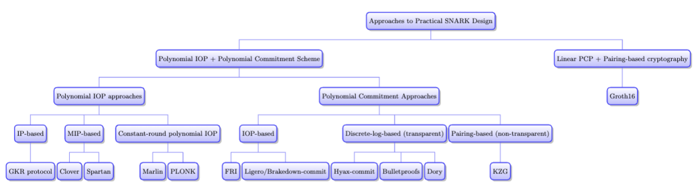

# Chapter 19: Bird’s Eye View of Practical Arguments

## A Taxonomy of SNARKs

- 4 approach of practical SNARKs
	- Interactive proof for arithmetic circuit evaluation (GKR protocol)
	- MIPs for circuit or R1CS satisfiability
	- Constant-round polynomial IOP for circuit or R1CS satisfiability
	- Linear PCP

**Pros and cons of three first approach in section 10.6**.

a fifth approach to argument design, based on commit-and-prove techniques (13.1) (not so related)

 (IP-based, MIP-based, and constant-round-polynomial-IOP-based) 

 the information-theoretically secure protocol 
 +
 any extractable polynomial commitment scheme
 =
  succinct argument

Only one technique to to turn linear PCPs into publicly-verifiable SNARKs, based on pairings and very similar to KZG polynomial commitments,

IP-based and MIP-based argument systems, the polynomial commitment scheme must allow committing to multilinear polynomials.

the IOP-based argument system, the polynomial commitment scheme must allow committing to univariate polynomials

three broad **approaches** to polynomial commitment schemes 
	some of these approaches have multiple instantiations with various cost tradeoff

	IOPs combined with Merkle hashing, where we saw FRI

	transparent Σ-protocols that assume hardness of the discrete logarithm problem, where we saw Hyrax-commit (Section 14.3), Bulletproofs (Section 14.4), and Dory

	KZG [KZG10] and uses pairings and a trusted setup (Section 15.2)

    = 
	“IOP- based”, “discrete-log-based”, and “KZG-based”.

**pros and cons of the various polynomial commitment schemes in Section 16.3.**

SNARKs via composition
	As discussed in Section 18.1, by taking a “fast-prover, larger-proof” SNARK and composing it with a “slower prover-smaller proof” SNARK, one can in principle obtain a “best-of-both-worlds” SNARK with a fast prover and small proofs.

## Pros and Cons of the Approaches

### Approaches minimizing proof size:

(1) constant-round polynomial IOPs combined with KZG-based polynomial commitments

(2) linear PCPs: smallest proof size, faster prover time

require a trusted setup

[SRS](../../terms/structured_reference_string.md) is universal and updatable for (1), computation-specific for (2)

 Computationally expensive for the prover.

**Transparency**: (depent on the polynomial commitment scheme)
	all of the remaining approaches are transparent unless they choose to use KZG-based polynomial commitments.
	
	uniform reference string (URS) rather than a structured reference string, and hence no toxic waste is p

**Post-quantum security**: depent on the polynomial commitment scheme)
		utilize an IOP-based polynomial commitment (FRI, Ligero, Brakedown)
		 No due to their reliance on the hardness of discrete log
**Dominant contributor to cost: polynomial commitments**

(the lone exception is that, if an MIP is combined with KZG commitments, it is the MIP and not the polynomial commitment that dominates verification costs)

Here is a brief summary of how concrete costs compare. Prover costs:
1. FRI and Bulletproofs >>
2. pairings (Dory and KZG commitments). 
3. ~ Hyrax, Ligero and Brakedown’s commitments
4.  Brakedown is slightly faster 

Commitment size and evaluation proof length:
1. Brakedown >Ligero > Hyrax  square-root size proofs
2. FRI  polylogarithmic
3. Dory > ! Bulletproofs logarithmic size
4. KZG-commitments for univariate polynomials (constant size).

Recent work called Orion [XZS22] reduces the size of Brakedown’s evaluation proofs via depth-one SNARK composition, but in so doing it relinquishes the field-agnostic nature of Brakedown and the proofs remain large (megabytes). Hyperplonk [CBBZ22] proposes to reduce the proof size much further, to under 10 KBs, by combining Brakedown or Orion with KZG commitments, though this relinquishes transparency in addition to field-agnosticism.

**Constant-round IOPs vs. MIPs and IPs.**

**IOPs**  much slower and more space intensive for the prover **MIPs and IPs** 

**On pre-processing and work-saving for the verifier**

**Prover time in holographic vs. non-holographic SNARKs**

