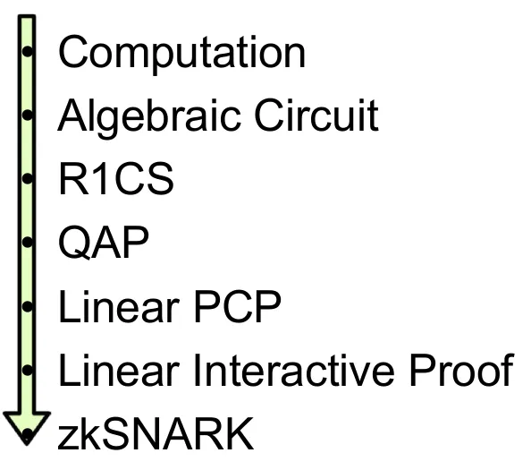

[Quadratic Arithmetic Programs: from Zero to Hero | by Vitalik Buterin | Medium](https://medium.com/@VitalikButerin/quadratic-arithmetic-programs-from-zero-to-hero-f6d558cea649)

The purpose of this post is not to serve as a full introduction to zk-SNARKs but rather to introduce the first half of the zk-SNARKs pipeline as follows.

The steps here can be broken up into two halves. First, zk-SNARKs cannot be applied to any computational problem directly; rather, you have to convert the problem into the right “form” for the problem to operate on. The form is called a “quadratic arithmetic program” (QAP).

We will use a commonly used zk-SNARK example of the equation $x^3 + x + 5 = 35$ here. The prover needs to prove he knows the answer to this equation (which is $x = 3$).

# Flattening

Break the equation down into a sequence of statements that are of two forms:

$x = y$ (where y can be a variable or a number)

or

$x = y$ (op) $z$ (where op can be +, -, *, / and y and z can be variables, numbers, or sub-expressions)

You can think of those as logic gates in a circuit.

The result of the flattening process for the above equation is as follows:

$sym_1 = x * x$

$y = sym_1 * x$

$sym_2 = y + x$

$~out = sym_2 + 5$

# R1CS

R1CS (Rank-1 Constraint System) is a system where you turn every equation from the Flattening step into a constraint system with the following formula:

> $A . s * B . s - C . s = 0$

where $A, B, C$ are vectors representing the mapping for the variables, and s is the full variable list.

Firstly, you take the result from the flattening step, which looks like this:

$C = A * B$

and change it to this form:

$A * B = C$

then

$A * B - C = 0$

so we will have

$x * x - sym_1 = 0$

$x * sym_1 - y = 0$

$(x+y)*1 = sym_2$

$(sym_2 + 5)*1 - ~out = 0$

then we will map all 4 lines into vectors $A, B,$ and $C$ corresponding to the format above using this mapping:

['~one', 'x', '~out', 'sym_1', 'y', 'sym_2']

we will have mapping vectors A, B, C, and variable vector s as follows:

A  
$[0, 1, 0, 0, 0, 0]$  
$[0, 0, 0, 1, 0, 0]$  
$[0, 1, 0, 0, 1, 0]$  
$[5, 0, 0, 0, 0, 1]$

B  
$[0, 1, 0, 0, 0, 0]$  
$[0, 1, 0, 0, 0, 0]$  
$[1, 0, 0, 0, 0, 0]$  
$[1, 0, 0, 0, 0, 0]$

C  
$[0, 0, 0, 1, 0, 0]$
$[0, 0, 0, 0, 1, 0]$
$[0, 0, 0, 0, 0, 1]$
$[0, 0, 1, 0, 0, 0]$

s  
$[1, 3, 35, 9, 27, 30]$

so you might be asking how do we get $A . s * B . s - C . s = 0$ to be true. So it all comes down to the property of dot product.

For example, if you have a vector $[1, 2, 3, 4, 5, 6]$,

then dot product it with vector $[0, 0, 1, 0, 0, 0]$,

and we have 3 as the result.

Apply that logic to the first line of A, B, and C, we have:

$x * x - sym_1 = 0$

so it means that we basically rewrite the equation but in a matrix form.

# QAP

Turn all columns of A 
into a matrix of polynomial $f(x)$ of $n-1$ degree using [Lagrange interpolation](../../terms/lagrange_interpolation.md) 

For example: 

the first column of matrix A is 

$[0, 0, 0, 5]$

so we will use _Lagrange interpolation_ to find a polynomial of 3 degree which equal to those 4 values at $x=1, x=2, x=3$ and $x=4$ or we can say that the polynomial go through 4 points $(1, 0), (2, 0), (3, 0), (4, 5)$

we call $f_{A1}$ as the first column's polynomial of A

$f_{A2}$ as the second column's polynomial of A

then

$f_{A1} (1)$ = first column first row

$f_{A1}(2)$ = first column second row

and so on

then we have 

$[f_{A1} (1), f_{A2} (1), f_{A3} (1), f_{A4} (1), f_{A5} (1)]$

equal to the entire first row of A
so instead of checking R1CS one by one, we now have three set of polynomials which give $A(x).s * B(x).s - C(x).s = 0$ at $x =1, x = 2, x = 3, x = 4$

or we say that the equation $t(x) = 0$ have root on $x=[1, 2, 3, 4]$

or $t(x)$ have the form of $(x-1)(x-2)(x-3)(x-4)h(x)$ with $h(x)$ being a function

for faster check, divide it with a basic polynomial $Z$ which is $(x-1)(x-2)(x-3)(x-4)$ and we have $h(x)$ with __no remainder__

however we can trick this system like use the input where $A = C$ and $B$ with $x = 1$
so we literally checking $A * 1 = C * 1$

Therefor, we are not done yet