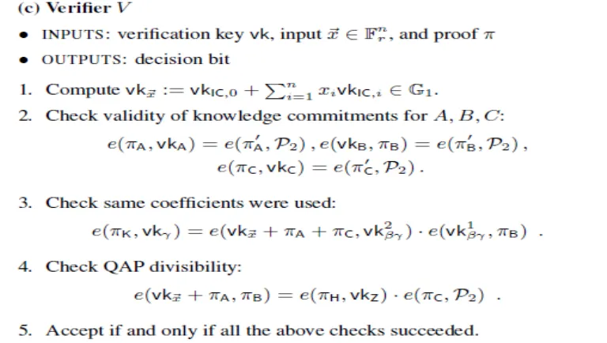

# Introduction

Remember that the solution to a QAP is a set of polynomials (A, B, C) such that A(x) * B(x) - C(x) = H(x) * Z(x), where:
- A is a linear combination of a set of polynomials ${A_1…A_m}$
- B is the linear combination of ${B_1…B_m}$ with the same coefficients
- C is a linear combination of ${C_1…C_m}$ with the same coefficients
- Z is the simplest polynomial equal to zero at all logic gates
Coefficients is $1, x, x^2, x^3, ... , x^m$

Note that from this step, we gonna be using [elliptic curve](../../terms/elliptic_curve.md), so we gonna have a generator point G (corresponding to 1 in elliptic curve) appear in our equation as a way to convert normal number into elliptic curve.

However, on a large system with thousands of logic gates like hash function or something, then the list prover need to send to verifier would be so long. So we use [knowledge of exponent](../../terms/knowledge_of_exponent.md) assumption and [trusted setup](../../terms/trusted_setup.md) to make it shorter.

On the other hand, using prefixed function Z = $(x-1)(x-2)(x-3)(x-4)$ as a divider for prover's QAP is not secure enough as it would create room for prover to make "fake" prove.

Here, we use random secret variable $t, k_a, k_b, k_c$ generated by the verifier, then encrypt it then send those encrypted number to prover. t will be a point where we evaluate our polynomial. $t, k_a, k_b$ and $k_c$ are “toxic waste”, numbers that absolutely must be deleted at all costs, or else whoever has them will be able to make fake proofs.

Hence, what actually happens is that we add the following values to the trusted setup:

- $G * A_1(t), G * A_1(t) * k_a$
- $G * A_2(t), G * A_2(t) * k_a$
- …
- $G * B_1(t), G * B_1(t) * k_b$
- $G * B_2(t), G * B_2(t) * k_b$
- …
- $G * C_1(t), G * C_1(t) * k_c$
- $G * C_2(t), G * C_2(t) * k_c$
- …

Now, if someone gives you a pair of points P, Q such that $P * k_a = Q$ (reminder: we don’t need $k_a$ to check this, as we can do a pairing check), then you know that what they are giving you is a linear combination of $A_i$ polynomials evaluated at t. By evaluate polynomials at t, we reduce the need to send the whole matrix of the polynomials; however, this raise a need to check for polynomials' coefficient in case the prover colluded and a need to check for $k_a, k_b, k_c$ in case prover insert $k_a', k_b', k_c'$ which $P' * k_a' = Q$ into the prove later on. 

Example for coefficient colluding instead of sending $a*G + b*G*t + c*G*t^2$, prover will send a point $a'*G$ instead.

Our coefficients in linear combination in the end of QAP step was $1, x, x^2, x^3, ... , x^m$ but we gonna evaluate our polynomials at t so it gonna turn into $G, G*t, G*t^2, G*t^3, ..., G*t^m$.

Hence, so far the prover must give:

- $π_a=G * A(t),π’_a=G * A(t) * k_a$
- $π_b=G * B(t),π’_b=G * B(t) * k_b$
- $π_c=G * C(t),π’_c=G * C(t) * k_c$

Where $A(t)$ is linear combination of $A_i$ evaluated at t and so on.
Linear combination A(t) was made from s and $A_i(x)$ for example we have $s = [1, 5, 11, 13, 17]$ we have $A(t) = 1*A_1(x) + 5*A_2(x) + 11*A_3(x) + 13*A_4 + 17*A_5$

Note that the prover doesn’t actually need to know (and shouldn’t know!) $t, k_a, k_b$ or $k_c$ to compute these values; rather, the prover should be able to compute these values just from the points that we’re adding to the trusted setup.

To evaluate the prove, we have to check 3 things:
- Validity of knowledge commitments for A, B, C or check if prover used A(t), B(t), C(t) inside $\pi_a, \pi_b, \pi_c$
- If same coefficients $G, G*t, G*t^2, ...$ were used in linear combination $\pi_a, \pi_b, \pi_c$
- Finally, check if the equation is correct like in QAP step

In my opinion, that should help to:
-  Check that people can't put two different variable $\pi_a, A(t)$ with no relation with each other.
- Check that people can't insert random variable by using coefficient check
- Finally check that $\pi_a$ is correct

Note that equation checking is done in pairing because we have secret number k, t and elliptic curve involved unlike in QAP step where x1, x2, x3, x4 is predetermined.

# QAP Divisibility

We need to prove that A * B - C = H * Z. We do this once again with a pairing check:

$e(\pi_a,\pi_b) / e(\pi_c, G)$ ?= $e(\pi_h, G * Z(t))$

Where $\pi_h=G * H(t)$ and $H$ is the remainder polynomial. If the connection between this equation and A * B - C = H * Z does not make sense to you, go back and read the [article on pairings](https://medium.com/@VitalikButerin/exploring-elliptic-curve-pairings-c73c1864e627). Note that $e(\pi_c, G)$ = $\pi_c$ but we do this in order to use pairing math.

We saw above how to convert A, B and C into elliptic curve points; G is just the generator (ie. the elliptic curve point equivalent of the number one). We can add $G * Z(t)$ to the trusted setup. H is harder; H is just a polynomial, and we predict very little ahead of time about what its coefficients will be for each individual QAP solution. Hence, we need to add yet more data to the trusted setup; specifically the sequence:

$G, G * t, G * t², G * t³, G * t⁴ ….$

In the Zcash trusted setup, the sequence here goes up to about 2 million; this is how many powers of t you need to make sure that you will always be able to compute H(t), at least for the specific QAP instance that they care about. And with that, the prover can provide all of the information for the verifier to make the final check.

Note: instead of send a list of parameter s to verifier like in the previous step, we send the remainder H to verifier

# Coefficients Check

The next step is to make sure that all three linear combinations have the same coefficients. This we can do by adding another set of values to the trusted setup: $G * (A_i(t) + B_i(t) + C_i(t)) * b$, where b is another number that should be considered “toxic waste” and discarded as soon as the trusted setup is completed. We can then have the prover create a linear combination with these values with the same coefficients, and use the same pairing trick as above to verify that this value matches up with the provided $A + B + C$.

$G * (A_i(t) + B_i(t) + C_i(t)) * b$

should be (in pairing) equals to

$G * (1 + t^1 + t^2 + ...) * s * (A + B + C) * b$

# Validity of Knowledge Commitments for A, B, C

Check if there is A(t) inside $\pi_a$ using [knowledge of exponent](../../terms/knowledge_of_exponent.md) 

The prover have $G, k, \pi_a$ but he can't come up with $\pi_a'$ if he doesn't know A(t) which $G * A(t) * k = \pi_a'$

we have two pair $(G, k)$ and $(\pi_a, \pi_a')$
the only way i can know the later is by using the first pair and multiply it with A(t)

Check using 3 pairing equation:

$e(\pi_a, k_a) = e(\pi_a', G)$

$e(\pi_b, k_b) = e(\pi_b', G)$

$e(\pi_c, k_c) = e(\pi_c', G)$
# Generalize

There is one more detail that we need to discuss. Most of the time we don’t just want to prove in the abstract that some solution exists for some specific problem; rather, we want to prove either the correctness of some specific solution (eg. proving that if you take the word “cow” and SHA3 hash it a million times, the final result starts with 0x73064fe5), or that a solution exists if you restrict some of the parameters. For example, in a cryptocurrency instantiation where transaction amounts and account balances are encrypted, you want to prove that you know some decryption key k such that:

1. decrypt(old_balance, k) ≥ decrypt(tx_value, k)
2. decrypt(old_balance, k) - decrypt(tx_value, k) = decrypt(new_balance, k)

The encrypted old_balance, tx_value and new_balance should be specified publicly, as those are the specific values that we are looking to verify at that particular time; only the decryption key should be hidden. Some slight modifications to the protocol are needed to create a “custom verification key” that corresponds to some specific restriction on the inputs.

# Complexity

Altogether, the verification process is a few elliptic curve multiplications (one for each “public” input variable), and five pairing checks, one of which includes an additional pairing multiplication. The proof contains eight elliptic curve points: a pair of points each for A(t), B(t) and C(t), a point $π_k$ for $b * (A(t) + B(t) + C(t))$, and a point $π_h$ for H(t). Seven of these points are on the $F_p$ curve (32 bytes each, as you can compress the y coordinate to a single bit), and in the Zcash implementation one point ($π_b$) is on the twisted curve in $F_p^2$ (64 bytes), so the total size of the proof is ~288 bytes.

The two computationally hardest parts of creating a proof are:

- Dividing (A * B - C) / Z to get H (algorithms based on the [Fast Fourier transform](https://en.wikipedia.org/wiki/Fast_Fourier_transform) can do this in sub-quadratic time, but it’s still quite computationally intensive)
- Making the elliptic curve multiplications and additions to create the A(t), B(t), C(t) and H(t) values and their corresponding pairs

The basic reason why creating a proof is so hard is the fact that what was a single binary logic gate in the original computation turns into an operation that must be cryptographically processed through elliptic curve operations if we are making a zero-knowledge proof out of it. This fact, together with the superlinearity of fast Fourier transforms, means that proof creation takes ~20–40 seconds for a Zcash transaction.

# Neglect the Need for Trusted Setup

tl;dr: The process of a "trusted setup" can be negligible using a system of key like in Diffie–Hellman algorithm

Another very important question is: can we try to make the trusted setup a little… less trust-demanding? Unfortunately we can’t make it completely trustless; the KoE assumption itself precludes making independent pairs ($P_i, P_i * k$) without knowing what k is. However, we can increase security greatly by using N-of-N multiparty computation - that is, constructing the trusted setup between N parties in such a way that as long as at least one of the participants deleted their toxic waste then you’re okay.

To get a bit of a feel for how you would do this, here’s a simple algorithm for taking an existing set ($G, G * t, G * t^2, G * t^3…$), and “adding in” your own secret so that you need both your secret and the previous secret (or previous set of secrets) to cheat.

The output set is simply:

$G, (G * t) * s, (G * t^2) * s^2, (G * t^3) * s^3…$

Note that you can produce this set knowing only the original set and s, and the new set functions in the same way as the old set, except now using t*s as the “toxic waste” instead of t. As long as you and the person (or people) who created the previous set do not both fail to delete your toxic waste and later collude, the set is “safe”.

Doing this for the complete trusted setup is quite a bit harder, as there are several values involved, and the algorithm has to be done between the parties in several rounds. It’s an area of active research to see if the multi-party computation algorithm can be simplified further and made to require fewer rounds or made more parallelizable, as the more you can do that the more parties it becomes feasible to include into the trusted setup procedure. It’s reasonable to see why a trusted setup between six participants who all know and work with each other might make some people uncomfortable, but a trusted setup with thousands of participants would be nearly indistinguishable from no trust at all - and if you’re really paranoid, you can get in and participate in the setup procedure yourself, and be sure that you personally deleted your value.
