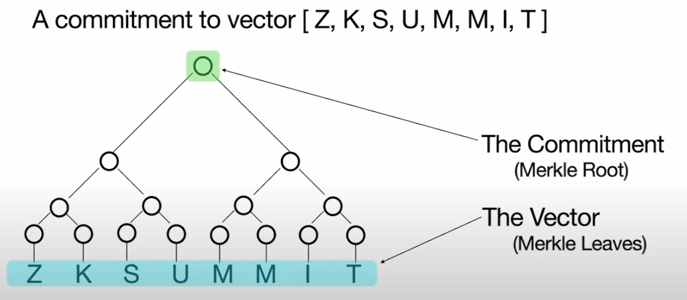

# Fast Reed - Solomon Interactive Oracle Proof of Proximity

References:

+ [Low Degree Testing](https://medium.com/starkware/low-degree-testing-f7614f5172db)
+ [STARKs by Vitalik](https://vitalik.eth.limo/general/2017/11/22/starks_part_2.html)
+ [FRI Mechanics by RISC Zero](https://www.youtube.com/watch?v=wqRuoyH3Mqk&t=1032s&ab_channel=RISCZero)
+ [FRI explanation by example](https://dev.risczero.com/proof-system/stark-by-hand#lesson-11-fri-protocol-commit-phase)
+ [FRI lecture](https://www.youtube.com/watch?v=A3edAQDPnDY&ab_channel=Blockchain-Web3MOOCs)

## Low Degree Testing

Low degree testing refers to the problem of deciding whether a given function is a polynomial of some bounded degree.

FRI protocol uses the idea of testing two polynomials with half the queries and splitting a polynomial into two smaller ones.

## What is FRI For?

Proving a vector commitment is (close to) a Reed-Solomon codeword (Low-degree polynomial).

## How Does FRI Work?

Iteratively "folding" the commitment into smaller and smaller commitments.

Queries ensure the folding was done properly.

## Roadmap

1. [Merkle Tree](fri.md#Merkle%20Tree)
2. [Mechanics of FRI](fri.md#Mechanics%20of%20FRI)
3. [Polynomial Commitment from FRI](fri.md#Polynomial%20Commitment%20from%20FRI)

## Merkle Tree

FRI ultilizes Merkle trees to commit to a vector. Each leaf of the trees represents an entry in the
vector, with the root serving as the commitment.

A commitment to a polynomial $q$, where each leaf corresponds to an evaluation of $q$ at a specific point.

The prover affirms that the leaves represent evaluations of $q$.

## Mechanics of FRI

### Prequirisites Knowledge

Prover Merkle-commits to evaluations $q(x)$ for those $x$ in a subset $\ohm$ of $\mathbb{F}_p$.

Subset $\ohm$ has size $n = \rho^{-1}k$, comprises all $n$-th [roots of unity](../docs/plonk.md#Roots%20of%20Unity) in $\mathbb{F}_p$.

+ $k$ is the degree of $q$.
+ Assume $n$ is a power of 2.
+ $\rho^{-1} \geq 2$ is called the "FRI blowup factor".
+ $\rho \leq 1/2$ is called the "rate of the Reed-Solomon code" used.
+ $\lambda$ is the security parameter a.k.a "$\lambda$ bits of security".

> [!NOTE] Tradeoffs in blowup factor
> The bigger $\rho^{-1}$ is:
> 
> + The slower prover is
> + The smaller verifier costs will be

Let $\omega \in \mathbb{F}_p$ be a primitive $n$'th root of unity. That
is, $n$ is the smallest integer such that $\omega^n = 1$. Then $\ohm = \{1, \omega, \omega^2, ..., \omega^{n-1} \}$.

$\ohm$ is a "multiplicative subgroup" of $\mathbb{F}_q$

+ If $x$ and $y$ are both $n$'th roots of unity, then so is $xy$.
+ Since $n$ is even: if $x$ is a $n$'th root of unity, $x^2$ is a ($n/2$)'th root of unity.
+ Since $n$ is even: if $x$ is a $n$'th root of unity, so is $-x$.

$\ohm$ has size $n$ if and only if $n$ divides $p - 1$

+ $p - 1$ is divisible $2^{32}$.
+ Running FRI over the field can support any power-of-two value of $n$ up to $2^{32}$.

> [!NOTE] Element in domain $\ohm$
> To let FRI work, we need the property that for every $\omega$ in the domain $\ohm$, it holds that $-\omega$ is also in $\ohm$.

### Folding Phase (or Commit Phase)

#### High Level Idea

Verifier picks a random field element $r$, and uses it to "randomly combine" every two paired-up entries.

The prover then Merkle-commits to the folded vector. The random combining technique is
chosen so that the folded vector will have half the degree of the original vector.

This folding process is repeated util the degree should falls to 0.

At this point, the length of the folded vector is still $\rho^{-1} \geq 2$. However, since the degree should
be 0, the prover can specify the folded vector with a single field element.

The folding phase consists of $\log(k)$ rounds.

#### Detail

Split $q(X)$ into "even and odd" parts in the following sense

+ $q(X) = q_e(X^2) + Xq_o(X^2)$
+ E.g., if $q(X) = 1 + 2x + 3X^2 + 4X^3$
  + Then $q_e(X) = 1 + 3X$ and $q_o(X) = 2 + 4X$
  + Both $q_e$ and $q_o$ have (at most) half the degree of $q$
+ Verifier picks a random field element $r$ and sends $r$ to prover.
+ The prescribed "folding" $q$ is: $q_{fold}(Z) = q_e(Z) + rq_o(Z)$.
+ The degree of $q_{fold}$ is half the degree of $q$ itself.

> [!NOTE] The domain of $q_{fold}$
> The commitment on $q_{fold}$ will not be over $\ohm$ but over $\ohm^2 = {\omega^2: \omega \in \ohm}$.
> 
> $\ohm^2$ will also have to satisfy the $\{ \omega, -\omega \}$ property, and so on.

Let $x$ and $-x$ be $n$'th roots of unity and $z = x^2$. Then:
$$q_{fold}(z) = \frac{r + x}{2x}q(x) + \frac{r - x}{-2x}q(-x)$$
The map $x \to x^2$ is 2-to-1 on $\omega = \{1, \omega, \omega^2, ..., \omega^{n-1}\}$ ensures that the relevant
domain halves in size with each fold.

### Query Phase

The verifier picks about $\lambda / \log(\rho^{-1})$ entries of each folded vector and confirms each is the
prescribed linear combination of the relevant two entries of the previous vector.

The proof length (and verifier time) is roughly $\lambda / \log(\rho^{-1}) \cdot \log^2(k)$ hash evaluations.

The query phase consists of one round.

## Polynomial Commitment from FRI

For any degree-$d$ univariate polynomial $q$, the assertion "$q(r) = v$" is equivalent to the
existence of a polynomial $w$ of degree at most $d$ such that:
$$q(X) - v = w(X)(X - r)$$
So to confirm that $q(r) = v$, the verifier applies FRI's fold and query procedure to the function
$(q(X) - v)(X - r)^{-1}$ using degree bound $d-1$.

+ Whenever the FRI verifier queries this function at a point in $\ohm$, the evaluation can
 be obtained with one query to $q$ at the same point.
