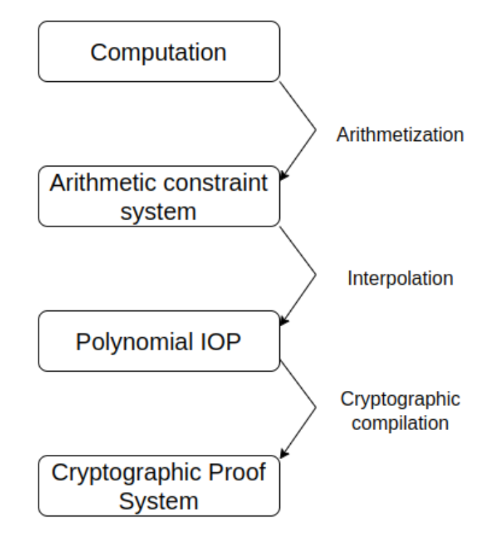
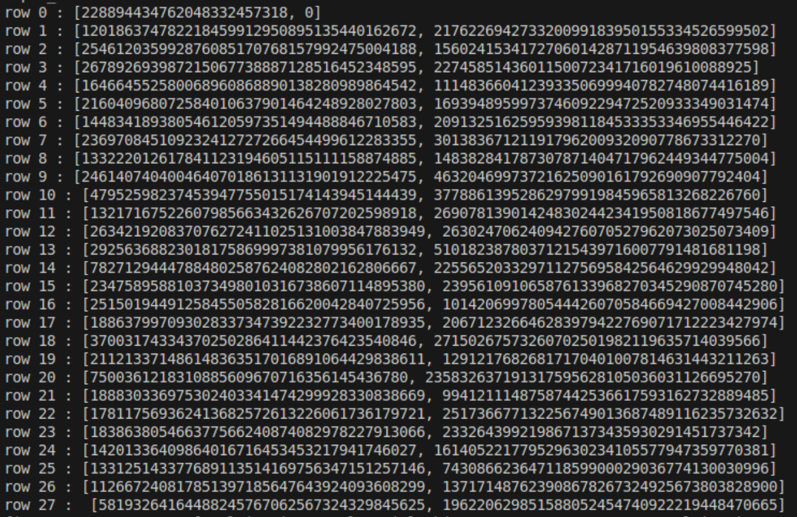

# STARK's Mechanics

## Introduction

STARK stands for Scalable Transparent ARguments-of-Knowledge. There are some key features of STARK:

- **Scalable**: The prover has a running time that is at most quasilinear in the size of the computation, and verification time is
  poly-logarithmic in the size of the computation.
- **Transparent**: No [trusted setup](../terms/trusted_setup.md) procedure is needed to instantiate the proof system, and hence
  there is no cryptographic toxic waste.
- Hash functions are the only cryptographic ingredient.
- Arithmetization is based on **AIR** (Algebraic Intermediate Representation).
- It reduces the claim about [computational integrity](../terms/computational_integrity.md) to one about the
  [low degree](../terms/low_degree.md) certain polynomials.
- The low degree of polynomials is proven using [FRI](./fri.md).
- ZKP is optional.

## Mechanics

### Overview

There are 4 main stages and three transformations of STARK:

Arithmetization means transforming the [computation](../terms/computation.md)
into a set of equations and tuples, including various constraints expressed in terms of finite field numbers and operations, called the
Arithmetic Constraints System. Next, these are all represented using univariate polynomials through various mathematical techniques,
which are Polynomial IOP. Finally, STARK uses a cryptographic proof system to commit to and verify these polynomials.

The next sections will provide a detailed description of each transformation.

### Arithmetization

First, we define a **state** in a virtual machine is a list of registers. A program consists of instructions, each of which changes the
state in a cycle. We also consider the trace of a program as a list of all the states during the execution. Specially, we define the
trace as a table of $T$ rows and $w$ columns, where $T$ is the number of cycles and $w$ is the number of registers.

For example, we consider a [Rescue-Prime hash function](https://eprint.iacr.org/2020/1143.pdf) as our program. STARK can claim that
the output is $58193264164488245767062567324329845625$ with an input of $228894434762048332457318$, without revealing the input.

Here is the trace of this program, with $2$ registers:

We need to define two constraints in our Arithmetic Constraint System: [boundary constraints](../terms/boundary_constraints.md) and
[transition constraints](../terms/transition_constraints.md).

For example, with the **Rescue-Prime** function above, $B = \lbrace (0, 1, 0), (T, 0, 58193264164488245767062567324329845625) \rbrace$
and the transition polynomial for register $i$-th is:
$M(X^\alpha)+f_{c_{2i}}(W)=(M^{−1}(Y−f_{c_{2i+1}}(W)))^\alpha$ (read the [paper](https://eprint.iacr.org/2020/1143.pdf) for details of
this function).

So, after this transformation, we have boundary constraints, transition constraints and a trace. Next, we need to interpolate them into
Polynomial IOP.

### Interpolation

You shoud read the definition of interpolation [here](../terms/lagrange_interpolation.md).

To transform the Arithmetic Constraint System into Polynomial IOP, we need to convert boundary constraints, transition constraints
and the trace into univariate polynomials.

First, we should interpolate the trace into **trace polynomials**, which are $w$ univariate polynomials. Each resulting polynomial
$P_i(X)$ represents the state of register $i$-th.

Which boundary constraints, given a set of tuple $(r, c, e)$, validating that register $c$ has value $e$ at cycle $r$ means validating
that $P_c(r) = e$. In other words, there exists a quotient polynomial $Q_c(x) = \dfrac{P_c(x) - e}{x - r}$ .  Therefore, we transform
boundary constraints into $w$ **boundary quotients** $Q_i(x)$, which are univariate.

For the $w$ multivariate polynomials of transition constraints, we need to convert them into univariate polynomial via
[symbolic evaluation](../terms/symbolic_evaluation.md).

We evaluate transition constraints in the trace polynomials $P_i(x)$ to get $w$ transition polynomials. Then, we transform the
transition polynomials into transition quotients, similar to the boundary quotients mentioned above.

So, at the end of this step, we have $w$ boundary quotients and $w$ transition quotients. Our goal now is to demonstrate the existence
and low-degree nature of all $2*w$ polynomials using the [FRI](./fri.md) commitment scheme.

### Cryptographic Compilation

We use FRI to commit all the quotient polynomials above. However, committing all of them individually is too expensive. Therefore, we
employ a **random nonlinear combination** method to merge all polynomials into a single entity.

For details, suppose we want to establish that $f_0(X),..., f_{n-1}(X)$ represent polynomials of degrees bounded by $d_0,...,d_{n-1}$.
We compute the nonlinear combination as follows:

- $2^k \ge max(d_i)$
- $g(X) = \sum_{i=0}^{n-1} \alpha_i \cdot f_i(X) + \beta_i \cdot X^{2^k-d_i-1} \cdot f_i(X)$

We denote $g(X)$ as the result of random nonlinear combination of $w$ boundary quotients and $w$ transition quotients. The prover now
needs to prove two things:

- $g(X)$ is a low-degree polynomial.
- The method used for the random nonlinear combination is correct.

To achieve this, the prover commits to:

- $g(X)$ via FRI.
- $w$ boundary quotients via [Merkle Tree](./fri.md#Merkle%20Tree) (each polynomial corresponds to a Merkle Tree).

The verifier can verify the proof by:

- Verifying $g(X)$ via the FRI proof.
- Verifying the leaves of the combination polynomial via the openings of $w$ boundary quotients.

For the implementation, we recommend you to see [this](https://github.com/aszepieniec/stark-anatomy).

## Appendix

To make STARK zero knowledge, we should add some randomizers to the trace of program.

There are also some ways to make STARK faster such as FFT or using preprocessing for computing the vanishing polynomial effectively.

## References

[STARK Anatomy - Aszepieniec](https://aszepieniec.github.io/stark-anatomy/index).

[STARK paper](https://eprint.iacr.org/2018/046.pdf)

[STARK Math series - STARKWare]([https://medium.com/starkware/tagged/stark-math](https://medium.com/starkware/tagged/stark-math))
